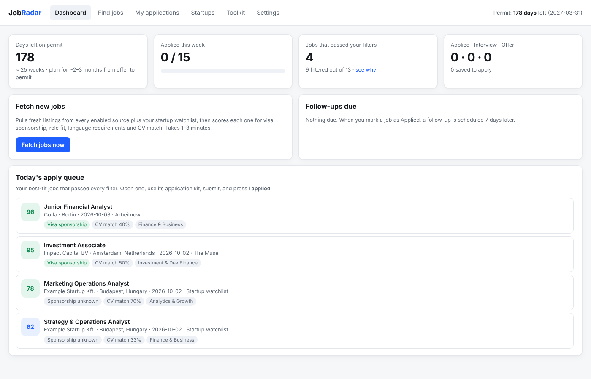
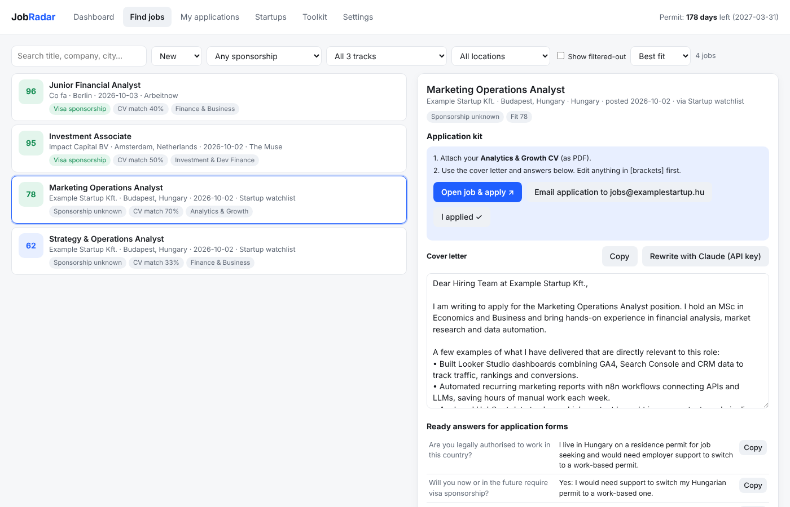
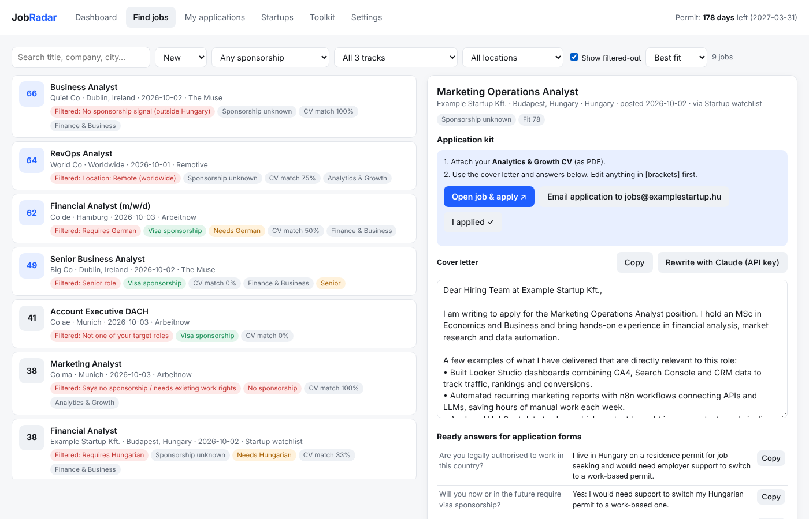
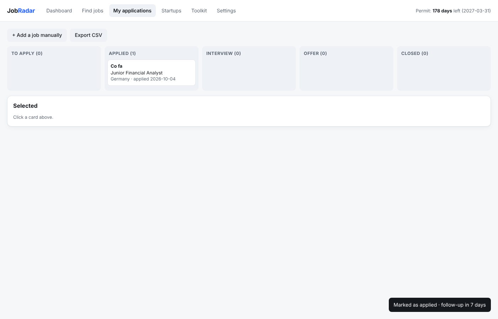

# JobRadar

**An AI-assisted job-search app for international candidates looking for visa-sponsoring jobs in Europe.**

JobRadar pulls fresh listings from 7 public job APIs plus startup careers pages, keeps only the jobs that match your target roles, countries and language, flags which ones sponsor visas, and prepares a ready-to-submit application kit for each one: the right CV, a tailored cover letter and answers to the usual form questions.

Built by **Nii Lante Emmanuel Lamptey** ([LinkedIn](https://www.linkedin.com/in/emmanuel-lamptey-7120161a2/)) with Claude as an AI coding partner.



## Why I built it
Job boards don't filter for visa sponsorship, and most "remote" roles quietly require existing work rights. As a non-EU graduate in Hungary, I was spending hours reading ads only to find "no sponsorship" or "fluent German required" at the bottom. JobRadar reads them for me and ranks what's left.

## What it does

| Feature | How it works |
|---|---|
| **Job aggregation** | Arbeitnow (with its visa-sponsorship filter), The Muse, Remotive, RemoteOK, Jobicy, Himalayas, optional Adzuna, plus a watchlist of startups on Greenhouse, Lever, Ashby and Workable |
| **Target tracks** | A job only counts if its title matches one of three tracks: Analytics & Growth (marketing, RevOps, SEO/GEO, AI ops), Finance & Business (financial, FP&A, reporting, business analyst) and Investment & Dev Finance (investment, credit, trade and impact finance) |
| **Strict filters, with reasons** | Removes wrong roles, jobs outside your chosen countries, US-only or worldwide remote roles, ads written in or requiring another language, "no sponsorship" ads, senior roles, and (outside your home country) ads with no sponsorship signal. Every removed job shows why. |
| **Visa-sponsorship detection** | Positive signals (visa sponsorship, relocation package, EU Blue Card, highly-skilled migrant) versus negatives ("must be eligible to work in the EU", "valid work permit required"), with the evidence shown |
| **CV match** | Compares ~150 skills between the ad and the right CV for that track (two CVs supported) |
| **Application kit** | For each job: which CV to attach, a tailored cover letter, ready answers to common application-form questions, and a pre-filled email when the ad gives an address. You review and submit. |
| **Application tracker** | Daily apply queue, pipeline from Saved to Offer, 7-day follow-up reminders, weekly goal, permit-expiry countdown, CSV export |







*Screenshots use sample data and fictional companies.*

## Tech
- **Python 3 standard library only:** no installs; `http.server` backend, SQLite storage, `urllib` API clients
- **Vanilla HTML/CSS/JS** single-page front end, light and dark mode
- **Claude API** (optional) for AI-written cover letters; picks the newest available model automatically
- Runs locally on `127.0.0.1`; your data never leaves your computer. Requests from other websites are blocked.

## Run it
1. Install Python 3.9+ ([python.org](https://www.python.org/downloads/)). On Windows, tick "Add python.exe to PATH".
2. Download this repo (green **Code** button → **Download ZIP**) and unzip it.
3. Double-click `start_windows.bat` (Windows) or `start_mac_linux.command` (Mac), or run `python app.py`.
4. Your browser opens at http://127.0.0.1:8765. Go to **Settings**, paste your CV and profile, then press **Fetch jobs now**.

Optional: a free [Adzuna](https://developer.adzuna.com/) key adds on-site jobs in Germany, the Netherlands, Austria, Poland and more; an [Anthropic API key](https://console.anthropic.com/) enables AI-written letters.

**Troubleshooting**
- *Mac: every source fails with CERTIFICATE_VERIFY_FAILED.* Open Applications › Python 3.x and run `Install Certificates.command`.
- *Port in use?* Run `JOBRADAR_PORT=8800 python app.py`.

## Project structure
```
app.py        local web server, API routes, SQLite storage, ranking
sources.py    job-board and careers-page (ATS) fetchers
analyze.py    sponsorship, language, role-fit, CV-match and cover-letter logic
index.html    single-page user interface
cv.txt, cv_analytics.txt, settings.json, watchlist.json   sample CVs, settings and startup watchlist
```

## Notes
- "Sponsorship unknown" does not mean no; many companies sponsor without saying so.
- Please don't fetch more than a few times a day; the job APIs are free community services.
- Always confirm visa rules on official government sites.

## License
MIT
